# Indian Banking Fraud & Audit Analytics

### PostgreSQL • 550K Transactions • Fraud Screening • Audit Analytics • Interactive Dashboard

An end-to-end SQL analytics project analyzing **550,000 synthetic Indian banking transactions** across **2019–2024** to identify transaction patterns, audit anomalies, fraud-risk signals, geographic exposure, and operational insights.

The project progresses from data validation and exploratory analysis to advanced PostgreSQL techniques, rule-based audit controls, transaction risk scoring, threshold evaluation, and an interactive banking intelligence dashboard.

> **Dataset Scope:** This project uses a synthetic Kaggle dataset designed to represent Indian banking transactions. It does not represent the complete Indian banking system or nationwide transaction volumes.

---

## 🌐 Live Interactive Dashboard

### [Launch Indian Banking Intelligence Dashboard](https://yash-andhrutkar.github.io/Indian-Banking-Fraud-SQL-Analysis/dashboard/indian_banking_intelligence_dashboard.html)

The dashboard provides an interactive presentation layer for the PostgreSQL analysis, including:

- Transaction KPIs and value trends
- Geographic transaction exposure
- Audit signal monitoring
- Rule-based risk distribution
- Screening precision and recall
- Interactive risk visualization
- Methodology and screening assumptions

> The dashboard is a presentation layer built on the results of the SQL analysis. The underlying queries and pgAdmin outputs are included separately in this repository.

---

## Project Overview

| Metric | Result |
|---|---:|
| Transactions Analyzed | **550,000** |
| Unique Customers | **79,916** |
| Dataset Period | **2019–2024** |
| Dataset Transaction Value | **₹16.45B** |
| Average Transaction | **₹29.9K** |
| Median Transaction | **₹2.04K** |
| Fraud Transactions | **4,873** |
| Fraud Rate | **0.89%** |
| High-Risk Screen | **1,061 transactions** |
| High-Risk Share | **0.19%** |

The substantial difference between the **₹29.9K average transaction value** and the **₹2.04K median** indicates a strongly right-skewed transaction distribution, with a relatively small number of high-value transactions materially increasing the mean.

---

## Business Questions

The analysis was designed to answer questions such as:

- How are transaction values distributed across the dataset?
- How does transaction activity change over time?
- Which states account for the largest transaction exposure?
- Which transaction behaviours warrant additional audit review?
- Can SQL-based rules identify unusual transaction patterns?
- Which transactions combine multiple risk indicators?
- How does changing the review threshold affect fraud capture and false positives?
- How can CTEs, window functions and parameterized rules create a reusable audit-screening framework?

---

## Key Findings

### Transaction Profile

- **550,000** transactions were analyzed across **79,916** customers.
- Dataset transaction value totaled approximately **₹16.45B**.
- Average transaction value was approximately **₹29.9K**, while the median was only **₹2.04K**.
- The 99th percentile transaction was approximately **₹530.5K**, demonstrating substantial right-tail concentration.
- The maximum recorded transaction was **₹10M**.

### Geographic Exposure

**Maharashtra** represented the largest transaction exposure in the dataset:

| State | Transactions | Transaction Value | Share of Value |
|---|---:|---:|---:|
| Maharashtra | 98,911 | ₹2.98B | 18.12% |
| Karnataka | 76,659 | ₹2.26B | 13.72% |
| Tamil Nadu | 71,747 | ₹2.15B | 13.06% |
| Delhi | 66,114 | ₹1.98B | 12.05% |
| Gujarat | 54,798 | ₹1.68B | 10.23% |

The five largest states together account for a substantial portion of transaction value in the dataset.

### Fraud Profile

- **4,873** transactions were labelled as fraud.
- Overall labelled fraud rate: **0.89%**.
- Fraud labels were used to evaluate the effectiveness of the rule-based screening framework rather than being directly incorporated into transaction risk scoring.

---

## Audit Signal Framework

The project implements transaction-level audit controls designed to identify activity that may warrant additional review.

| Audit Signal | Transactions Flagged |
|---|---:|
| Weekend Activity | **157,394** |
| Late Night Activity | **114,653** |
| Dormant Reactivation | **23,460** |
| High Value | **5,500** |
| Round Sum | **2,789** |
| Near Approval Threshold | **1,352** |
| High-Risk Combination | **1,060** |
| Potential Duplicate | **0** |
| High Velocity | **0** |

These flags are **screening indicators rather than confirmed fraud**. A flagged transaction indicates that it meets a defined audit condition and may warrant additional investigation.

Zero findings for duplicate and high-velocity controls were retained rather than modifying thresholds solely to manufacture positive results.

---

## Rule-Based Risk Engine

Multiple transaction-level indicators were combined into a reusable SQL risk-scoring framework.

### Risk Distribution

| Risk Level | Transactions | Share |
|---|---:|---:|
| Low | **542,171** | **98.58%** |
| Medium | **6,768** | **1.23%** |
| High | **1,061** | **0.19%** |
| **Total** | **550,000** | **100%** |

The framework is designed as an **audit-screening mechanism**, not as a production fraud-detection model.

---

## Screening Performance

The generated risk classifications were compared with the dataset's existing fraud labels.

### High-Risk Threshold

| Metric | Result |
|---|---:|
| True Positives | **77** |
| False Positives | **984** |
| False Negatives | **4,796** |
| True Negatives | **544,143** |
| Precision | **7.26%** |
| Recall | **1.58%** |

### Medium + High Threshold

| Metric | Result |
|---|---:|
| Precision | **3.12%** |
| Recall | **5.01%** |

Relaxing the review threshold from **High only** to **Medium + High** increases fraud capture from **1.58% to 5.01% recall**, but reduces precision from **7.26% to 3.12%**.

This illustrates a fundamental screening trade-off: broader review criteria capture more labelled fraud but also create substantially more false positives.

---

## Methodology Decisions

### Dormant Account Reactivation

Rather than selecting an arbitrary inactivity threshold, inter-transaction gaps were profiled across customer histories.

The approximate distribution showed:

- Median gap: **156 days**
- 75th percentile: **309 days**
- 90th percentile: **508 days**
- 95th percentile: **653 days**

A threshold of **653 days**, approximately the 95th percentile, was therefore selected for the dormant-reactivation control.

This reduced the likelihood of classifying normal transaction gaps as unusual solely because of an arbitrary rule.

### Target Leakage Prevention

Historical fraud incidence was analyzed separately as a descriptive customer-level metric.

However, prior fraud labels were **excluded from the transaction risk score** before evaluating the score against `is_fraud`.

Including the target label or a direct derivative of it in the scoring framework would create **target leakage** and artificially inflate apparent screening performance.

### Partial 2024 Data

The dataset extends to **January 1, 2024**, but 2024 contains only a partial period.

For this reason, the monthly Transaction Pulse visualization uses **2023**, the latest complete calendar year, while other analyses use the full available dataset where appropriate.

---

## SQL Techniques Demonstrated

This project applies PostgreSQL across multiple analytical levels:

- Data Definition Language (DDL)
- Data quality validation
- Aggregate functions
- Conditional aggregation
- `CASE` expressions
- Common Table Expressions (CTEs)
- Multi-stage CTE pipelines
- Window functions
- `LAG()`
- Running and rolling calculations
- Percentiles
- Customer-level transaction sequencing
- Date and time analysis
- Parameterized audit thresholds
- Rule-based risk scoring
- Precision and recall calculations
- Views
- Indexes
- Partial indexes
- Analytical segmentation
- Pareto-style concentration analysis

---

## Project Structure

```text
Indian-Banking-Fraud-SQL-Analysis/
│
├── sql/
│   ├── 00_schema_setup.sql
│   ├── 01_data_quality.sql
│   ├── 02_beginner_analysis.sql
│   ├── 03_intermediate_analysis.sql
│   ├── 04_advanced_analysis.sql
│   ├── 05_fraud_audit_challenge.sql
│   ├── 06_views_indexes.sql
│   └── 07_business_findings.sql
│
├── dashboard/
│   └── indian_banking_intelligence_dashboard.html
│
├── screenshots/
│   ├── 01_dataset_overview.png
│   ├── 02_transaction_distribution.png
│   ├── 03_monthly_transaction_trend.png
│   ├── 04_state_transaction_analysis.png
│   ├── 05_fraud_risk_distribution.png
│   ├── 06_audit_rule_summary.png
│   ├── 07_fraud_screening_evaluation.png
│   ├── 08_threshold_sensitivity.png
│   ├── 09_dashboard_overview.png
│   ├── 10_dashboard_audit_signals.png
│   └── 11_dashboard_risk_engine.png
│
├── sources/
│   └── data_source.md
│
├── .gitignore
│
└── README.md
```

---

## Analysis Workflow

The SQL files are organized to demonstrate progression from database setup to advanced analytical work.

| File | Purpose |
|---|---|
| `00_schema_setup.sql` | Database schema and date dimension setup |
| `01_data_quality.sql` | Row counts, missing values, duplicates and integrity checks |
| `02_beginner_analysis.sql` | Core aggregations and exploratory analysis |
| `03_intermediate_analysis.sql` | Segmentation, trends and comparative analysis |
| `04_advanced_analysis.sql` | CTEs, window functions and advanced transaction analytics |
| `05_fraud_audit_challenge.sql` | Audit controls, anomaly screening and risk scoring |
| `06_views_indexes.sql` | Reusable analytical views and performance-oriented indexes |
| `07_business_findings.sql` | Business-focused analytical queries and findings |

---

## SQL Analysis Evidence

### Dataset Overview

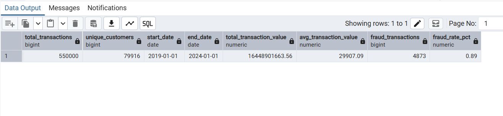

### Transaction Distribution

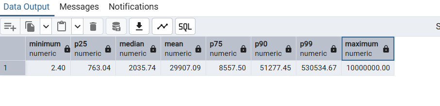

### Monthly Transaction Trend

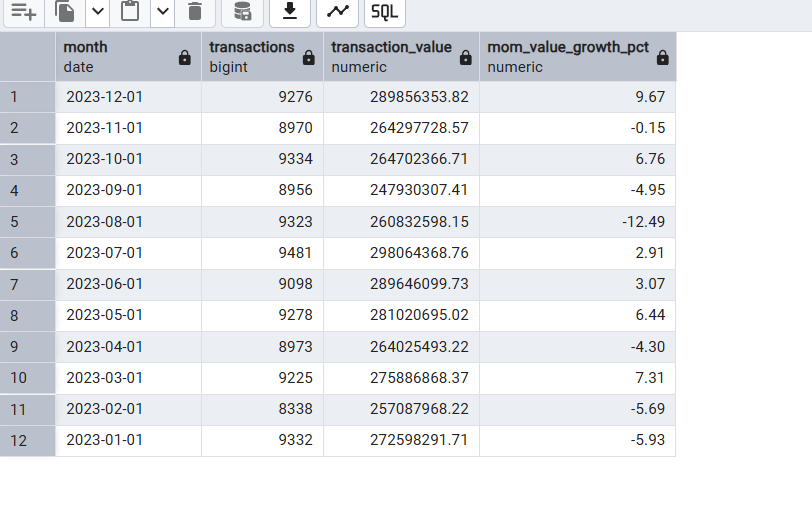

### Geographic Analysis

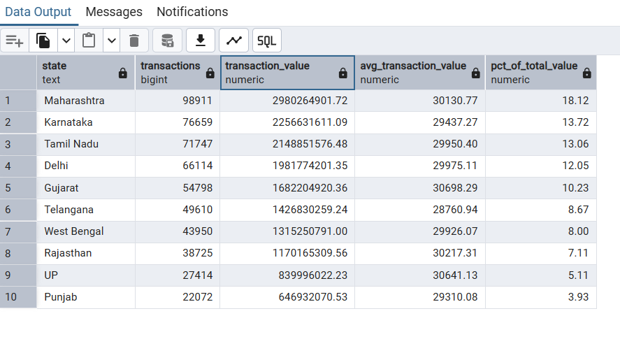

### Fraud Risk Distribution

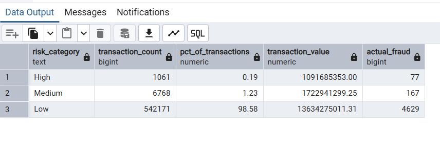

### Audit Rule Summary

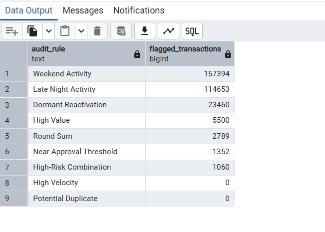

### Screening Evaluation

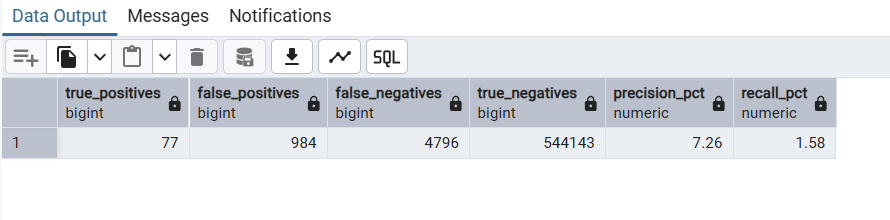

### Threshold Sensitivity

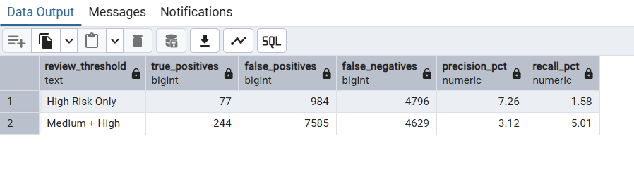

---

## Interactive Dashboard

The custom dashboard translates the SQL outputs into an interactive banking intelligence interface.

### Overview

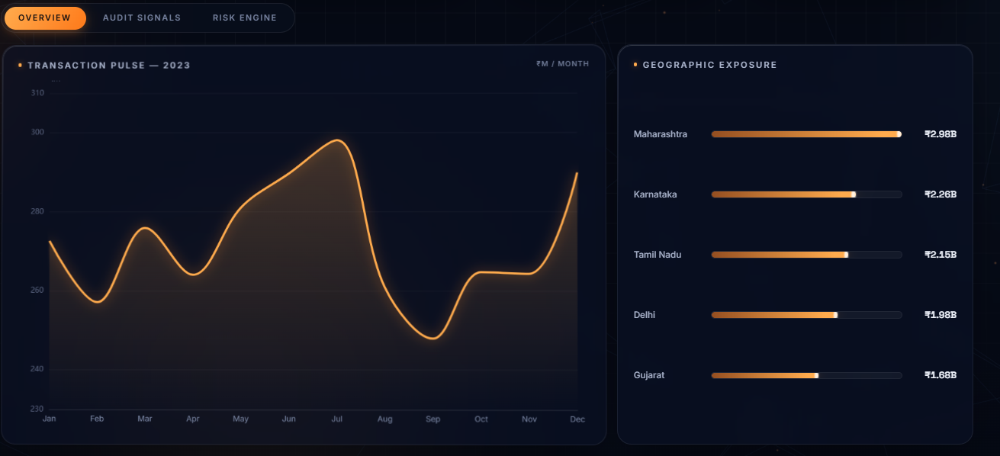

### Audit Signals

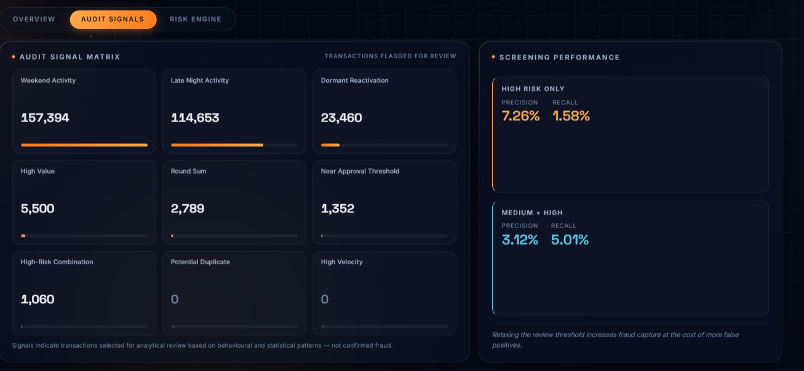

### Risk Engine

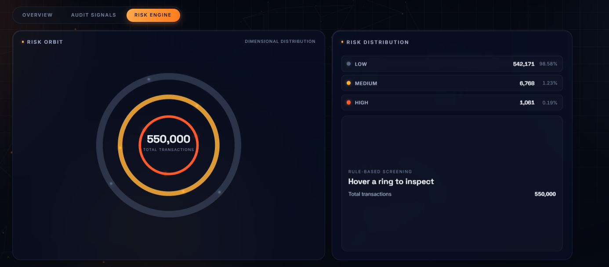

### [Open the Live Interactive Dashboard →](https://yash-andhrutkar.github.io/Indian-Banking-Fraud-SQL-Analysis/dashboard/indian_banking_intelligence_dashboard.html)

---

## Data Source

**Indian Banking Transactions 2019–2024 — Kaggle**

Dataset documentation and source information are available in:

[`sources/data_source.md`](sources/data_source.md)

The raw CSV is intentionally excluded from this repository. The dataset can be obtained directly from Kaggle.

---

## How to Reproduce the Analysis

### Requirements

- PostgreSQL
- pgAdmin or another PostgreSQL client
- Source CSV from Kaggle

### Execution Order

1. Run `sql/00_schema_setup.sql`.
2. Import the source CSV into `banking_transactions`.
3. Run `sql/01_data_quality.sql`.
4. Run `sql/02_beginner_analysis.sql`.
5. Run `sql/03_intermediate_analysis.sql`.
6. Run `sql/04_advanced_analysis.sql`.
7. Run `sql/05_fraud_audit_challenge.sql`.
8. Run `sql/06_views_indexes.sql`.
9. Run `sql/07_business_findings.sql`.

> **Important:** `00_schema_setup.sql` creates the required schema. It should be executed before importing the dataset into a fresh database.

---

## Limitations

- The dataset is **synthetic** and should not be interpreted as representative of India's complete banking system.
- Audit thresholds are analytical assumptions intended for portfolio demonstration rather than institution-specific regulatory controls.
- The risk engine is **rule-based**, not a trained machine-learning model.
- Low recall demonstrates that simple heuristic rules alone are insufficient for comprehensive fraud detection.
- Audit flags indicate transactions requiring review; they do not establish fraudulent activity.
- 2024 represents only a partial period and is therefore excluded from complete-year monthly trend comparisons.
- Production deployment would require institution-specific controls, validation, governance, monitoring and substantially richer behavioural features.

---

## Tools

**Database & Analysis**
- PostgreSQL
- pgAdmin
- SQL

**Dashboard**
- HTML
- CSS
- JavaScript
- ECharts
- Three.js
- GSAP

**Version Control & Deployment**
- GitHub
- GitHub Pages

---

## Project Objective

This project was developed to demonstrate how SQL can move beyond basic querying into a structured **financial transaction analytics and audit-screening workflow**.

The focus is not only on producing queries, but on translating transaction data into:

**data validation → exploratory analysis → behavioural signals → audit controls → risk screening → performance evaluation → business insights → interactive presentation**

---

### 🌐 [View Live Banking Intelligence Dashboard](https://yash-andhrutkar.github.io/Indian-Banking-Fraud-SQL-Analysis/dashboard/indian_banking_intelligence_dashboard.html)

---

*Portfolio project using synthetic data for analytical and educational purposes.*
